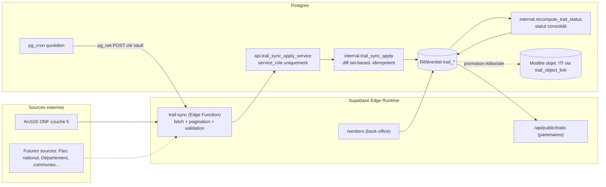
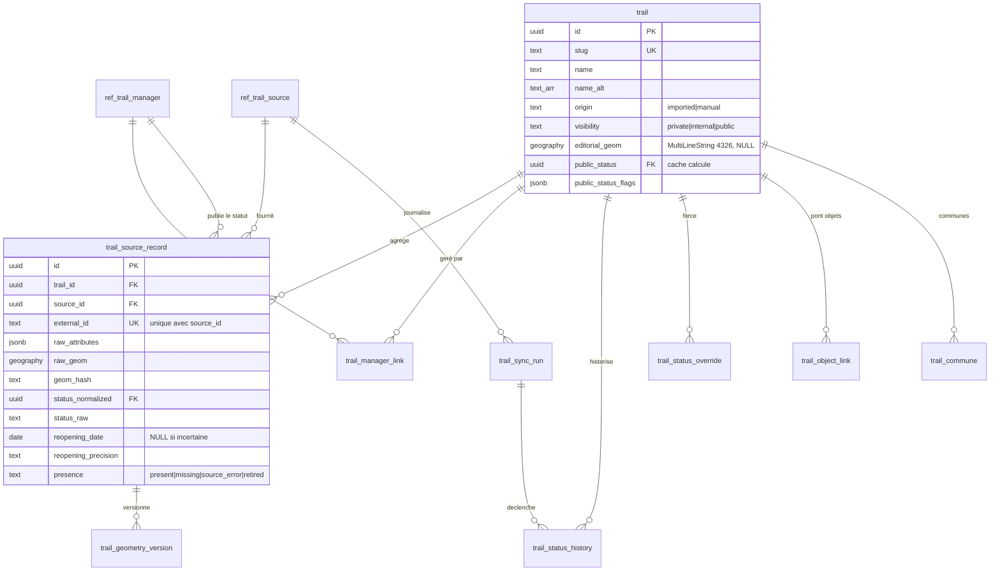
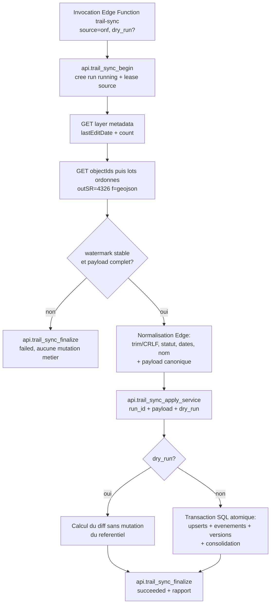
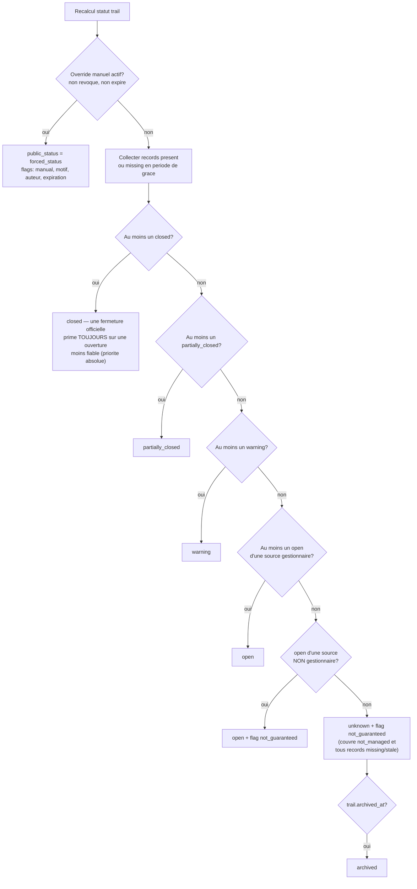
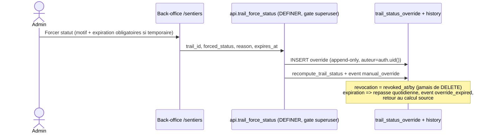

# Référentiel des sentiers de randonnée — conception (source initiale : ONF)

**Date** : 2026-07-12 · **Statut** : **validé pour implémentation** — les 9 arbitrages ont été rendus par le PO le 2026-07-12 (§24) ; rien n'est encore implémenté. · **Périmètre** : audit de l'existant + plan d'implémentation complet.
**Mission** : créer dans Bertel un référentiel de sentiers multi-sources, importé initialement depuis le FeatureServer ArcGIS public de l'ONF, avec géométries, statuts normalisés, historique, synchronisation automatique et back-office.

---

## 1. Résumé de l'existant (audité, pas supposé)

### 1.1 Base de données
- **Postgres Supabase, PostGIS 3.3.7 installé** (schéma `extensions`). Colonnes géo existantes — toutes en **`geography` / SRID 4326** (jamais `geometry`) :
  `object_iti.geom : LineString`, `object_iti_section.geom : LineString`, `object_iti_stage.geom : Point`, `object_location.geog2 : Point`, `incident_report.geom : Point`.
- **Modèle ITI complet mais vide** (0 objet `ITI`, 0 ligne `object_iti`) : facette `object_iti` (`geom`, `distance_km`, `duration_min`, `elevation_gain/loss`, `open_status` + `status_note` + `status_updated_at`, `cached_gpx/kml` en cache lazy), sous-modèle `object_iti_section` (tronçons LineString), `object_iti_stage` (étapes Point), `object_iti_info/practice/profile`, vocabulaire `ref_code_iti_open_status` (`open`, `closed`, `partially_closed`, `warning`).
- **Traçabilité source** : `object_origin` (`source_system`, `source_object_id`, `import_batch_id`) — une seule source par objet ; `object_external_id` (multi-lignes `(source_system, organization_object_id, external_id)`).
- **Vocabulaires** : `ref_code` partitionné par domaine ; pattern « domaine plat » = partition + uniques `(id)`/`(code)` + paire RLS maison (`migration_crm_module.sql:119-142`) ; pattern « taxonomie » = `ref_code_domain_registry` + racine + nœuds (`migration_object_type_prd.sql`). i18n **inline** (`name_i18n` jsonb).
- **`ref_commune`** : 24 communes INSEE, **sans géométrie** (pas de polygones communaux en base).
- **pg_cron 1.6.4 actif** — 4 jobs définis dans `Base de donnée DLL et API/maintenance.sql:155-203` (`refresh-mv-filtered-objects` 5 min, `refresh-open-status` 15 min, `maintain-partitions` 02:00, `capture-metric-snapshots` 03:00). **Aucun HTTP sortant depuis la DB** : ni `pg_net` ni extension `http` installées.
- **Aucune Edge Function Supabase déployée. Aucune intégration n8n, Apidae ou Tourinsoft** (grep = 0 ; Apidae/DATAtourisme n'apparaissent que comme référentiels de comparaison et profils d'interop **sortante** `migration_interop_profiles.sql`).
- **Imports passés** : schéma `staging` (batch `old_data_supabase_import_20260501/` : `import_batches`, tables `*_temp` avec `raw_source_data` jsonb + `resolution_status` + promotion finale) ; sync Berta = scripts Python `_berta_*.py` + SQL généré, exécution **Node `pg`** (`.tmp_pgapply/run_sql_file.cjs`, option `--validate` COMMIT→ROLLBACK) ; petites migrations via MCP Supabase.
- **Déploiement SQL** : manifest ordonné `docs/SQL_ROLLOUT_RUNBOOK.md` + gate CI fresh-apply (`ci_fresh_apply.sql`, `.github/workflows/sql-fresh-apply.yml`) + ~95 tests `tests/test_*.sql`. Toute migration = fichier + entrée manifest + test CI.
- **RLS** : invariants maison — per-command (jamais `FOR ALL` sur table enfant d'objet), `auth.*()` wrappé `(select …)` (§39, gate CI), lectures publiques via RPC `SECURITY DEFINER` authorize-once (§36), écritures sensibles RPC-only.
- **Modération** : `pending_change` (§120) = file soumission → approbation qui **re-dispatche un writer whitelisté** (`metadata->>'rpc'`) — précédent direct pour « publication après validation humaine ».

### 1.2 Frontend (bertel-tourism-ui)
- **Navigation** : registre unique `src/config/nav-items.ts` (D24), gating `requiresEdit`/rôles via `visibleNavItems`.
- **Pattern module plein-page** liste→détail : `/listes` (`views/ListsManageView.tsx` + `app/(main)/listes/[id]/page.tsx`) ; console admin à rail : `/settings` (`views/settings-nav.ts`, ex. panneau `OrgsPanel`).
- **Carte** : MapLibre (`react-map-gl/maplibre`) ; `components/explorer/MapPanel.tsx` **rend déjà des tracés LineString/MultiLineString** (couche ITI D18 : casing + ligne, `services/iti-tracks.ts`, `hooks/useItiTracks.ts`) ; éditeur de tracé `ItiTraceMap.tsx` ; import GPX `gpx-import.ts`.
- **Data-fetch dominant** : services RPC (`client.schema('api').rpc(...)`) + TanStack Query + Zustand.
- **API publique partenaire** : `/api/public/objects` (clé `bk_live_*` hashée, allowlist RPC `lib/public-api.ts:18`, enveloppe versionnée, `?track=gpx|kml`, pivots interop). Ajout d'une ressource = nouvelle route + RPC dans l'allowlist.
- **Signalements terrain** : table `incident_report` existe, **aucune UI branchée** (`/audits` = maquette démo non câblée).

### 1.3 Source ONF (sondée le 2026-07-12)
Service : `https://services1.arcgis.com/Y4HgaQpzkE7kenlE/arcgis/rest/services/Sentiers_La_Reunion_public/FeatureServer` — **vue ArcGIS publique** (`isView:true`), capability `Query` seule, requêtable anonymement, SR natif **EPSG:2975** (RGR92/UTM 40S), reprojection serveur `outSR=4326` OK, pagination supportée (`maxRecordCount` 2000 au niveau couche), formats `json`/`geojson`.

| Couche | Contenu | Géométrie | Volume |
|---|---|---|---|
| 1 | Aires d'accueil (`WA_Lieu`) | Point | 334 |
| 4 | Circulation des véhicules motorisés | Polyline | non audité |
| **5** | **Itinéraires de randonnée pédestre** | **Polyline** | **374** |

Couche 5 — champs réels : `OBJECTID` (OID), `WS_NomIti` (255), `WS_NomItiL` (nom abrégé, toujours renseigné), `WS_Statut` (30), `WS_InfCaus` (255), `WS_InfDate` (255, **texte libre**), `WS_LongM` (**smallint**, mètres), `Shape__Length`.
**`GlobalID` est déclaré (`globalIdFieldName`) mais NON exposé par la vue publique** (absent de la liste de champs ; `outFields=GlobalID` le retire silencieusement — vérifié). **Seule clé disponible : `OBJECTID`.**

Données au 2026-07-12 : 374 entités = **267 ouverts (718 km) + 54 fermés (197 km) + 53 hors gestion ONF (122 km)** ; 286 LineString + 88 MultiLineString (jusqu'à 6 parties), 0 géométrie vide, ~122 000 sommets au total, GeoJSON complet ≈ **4,6 Mo**. Coordonnées 2D, 13 décimales (bruit de reprojection). `editingInfo.lastEditDate` (2026-07-10) / `dataLastEditDate` (2026-07-03) exposés au niveau couche = signal de changement bon marché. Tracking d'édition par entité désactivé (pas de dates par feature).

Qualité observée : `WS_InfCaus` renseigné ~56 fois (44 valeurs distinctes, `\r\n` fréquents, mélange causes/consignes, « Fermé par arrêté municipal », « Travaux… mais sentier ouvert les samedis et dimanches ») ; `WS_InfDate` = 9 valeurs distinctes toutes textuelles (« Réouverture 2026 », « Pas de réouverture prévue à court terme », « 05/09/2026 », faute « Réouverure 2027/2028 ») ; 8 fermés **sans motif** ; 4 ouverts **avec motif** (avertissements) ; 1 doublon de nom exact (« Sentier du Trou de Fer » ×2 = deux tronçons distincts 3 550 m / 500 m) ; **29 noms polluent le libellé avec « (hors gestion ONF) »** ; **27 groupes de même nom de base** éclatés en portions par statut de gestion (ex. « Basse Vallée - Foc Foc par Piton Lardé » = portion ONF ouverte + portion hors gestion) ; 0 géométrie strictement dupliquée ; longueurs 17 m → 13 121 m, cohérentes.

**Sémantique de la couche 5** : malgré son nom « Itinéraires », c'est un **mélange** — majoritairement des itinéraires nommés, mais **découpés en tronçons aux frontières du domaine géré ONF** (les 27 groupes multi-portions) et parfois en portions par état. On la modélise donc comme des **sentiers-tronçons publiés** (unité de gestion/statut), PAS comme des itinéraires de randonnée éditoriaux.

---

## 2. Contraintes identifiées

1. **Pas de canal HTTP sortant existant** (ni pg_net, ni http, ni edge function, ni route appelée par cron) → la brique « fetch ArcGIS planifié » est **à créer** ; le reste (cron, journal, SQL set-based) a des précédents.
2. **`GlobalID` indisponible** → identifiant externe = `OBJECTID` seul, réputé stable tant que la couche hébergée n'est pas rechargée/republiée — risque de reset à documenter et mitiger (empreinte de réconciliation).
3. **Le modèle objet ne convient pas comme porteur du référentiel brut** : la publication d'un objet exige une ORG publisher (ONF n'est pas une ORG Bertel) ; `object_origin` est mono-source ; le churn de sync polluerait Explorer/dashboard/complétude ; les statuts ONF ≠ cycle de vie `object.status`. Le modèle objet reste en revanche la **cible éditoriale** (ITI) — voir §12.
4. **Convention géo maison = `geography(…,4326)`** ; s'y tenir (pas de `geometry` en public).
5. **Toute migration** doit entrer au manifest + gate CI fresh-apply + test SQL ; invariants RLS §36/§38/§39 obligatoires ; nouvelle partition `ref_code` = uniques `(id)`/`(code)` + paire RLS maison.
6. **Données ONF partiellement sales** (texte libre, portions, suffixes de nom) → normalisation à l'import, brut toujours conservé.
7. **`ref_commune` sans polygones** → le rattachement commune par intersection spatiale est impossible aujourd'hui (source polygones à ajouter, ou rattachement manuel).
8. **Licence/conditions d'utilisation des données ONF** : aucune mention de licence sur le service. **Position arbitrée (PO, 2026-07-12)** : n'utiliser que la donnée publique factuelle, **citer l'ONF uniquement comme source du statut** ; les contenus publiés (descriptions, photos, autres infos) seront remplacés par des contenus éditoriaux propres à Bertel avant toute publication. Pas de dépendance à un accord préalable.

---

## 3. Architecture cible — recommandation argumentée

### Option A (rejetée) — « chaque sentier ONF = un objet ITI »
Réutilise tout (Explorer, éditeur, GPX), mais : 374 tronçons bruts ≠ fiches touristiques ; publication bloquée par l'invariant ORG-publisher ; multi-sources impossible proprement (`object_origin` mono-source) ; chaque sync génèrerait du churn dans `object_version`/modération ; statuts « hors gestion » inexprimables sans tordre `object.status`. **Casse l'intégrité du modèle.**

### Option B (recommandée) — référentiel dédié `trail_*` + pont vers le modèle objet
Un **référentiel autonome** (tables `trail_*`, hors modèle `object`) porte : sources, gestionnaires, enregistrements par source, statuts normalisés + consolidation, géométries versionnées, historique, journaux de sync. Le **modèle objet reste la couche éditoriale** : une randonnée publiable dans l'Explorer = un objet `ITI` (facette `object_iti` existante : GPX, profil, étapes) **relié** à un ou plusieurs sentiers du référentiel via une table de pont. Séparation nette : donnée synchronisée (référentiel) / donnée éditoriale (objet ou champs éditoriaux du trail) / donnée calculée (statut consolidé).

- Orchestration réseau dans une **Supabase Edge Function `trail-sync`** : fetch ArcGIS, pagination, validation du snapshot, normalisation légère et journalisation. Le référentiel n'est ainsi pas couplé à la disponibilité du déploiement Next.js/Coolify.
- Écritures du moteur de sync **set-based et atomiques en SQL** (`internal.trail_sync_apply(...)`) derrière un wrapper RPC `api.trail_sync_apply_service(...)` exécutable par `service_role` uniquement ; la règle de consolidation reste en base afin que sync, overrides, expirations et actions manuelles passent toutes par la même logique.
- Planification **pg_cron** (pattern maison) → déclenchement de l'Edge Function via **pg_net** (à activer) — **arbitré** ; URL projet et clé technique nommée stockées dans **Supabase Vault**. Procédure cron Coolify documentée en simple secours.
- Lectures publiques via **RPC `SECURITY DEFINER`** filtrant la visibilité (pattern §36), exposition partenaire via `/api/public/*` + allowlist.



---

## 4. Modèle de données proposé

### 4.1 Principes
- **Séparer 5 notions** : source technique (`ref_trail_source`) ≠ gestionnaire du sentier (`ref_trail_manager`, n-n) ≠ organisme publiant le statut (porté par chaque relevé de statut) ≠ origine éditoriale (`trail.origin` + auteur) ≠ responsabilité/propriété (rôle du lien gestionnaire).
- **Pas de booléen `is_onf`** : « hors gestion ONF » = un statut normalisé `not_managed` porté par le relevé de la source ONF, combiné à l'absence de lien gestionnaire ONF.
- **1 sentier Bertel (`trail`) ← n enregistrements source (`trail_source_record`)** : multi-sources natif, création manuelle = un `trail` sans record source.
- **Le brut est toujours conservé** (`raw_attributes` jsonb, `raw_geom`, libellés bruts) ; le normalisé vit à côté, jamais à la place.
- Ids : `uuid` (`gen_random_uuid()` — invariant search_path §29). Le format 16 chars `generate_object_id` est réservé au modèle objet.

### 4.2 Tables

| Table | Rôle | Colonnes clés |
|---|---|---|
| `ref_trail_source` | Source technique de données | `id uuid`, `code` (`onf_arcgis_reunion`), `label`, `kind` (`arcgis_featureserver`/`manual`/`file`/`api`), `endpoint_url`, `layer_ref`, `default_trust` (1-100), `licence_note`, `is_active` |
| `ref_trail_manager` | Organisme gestionnaire | `id uuid`, `code` (`onf`, `parc_national`, `departement`, `commune_*`, `association`, `oti`, `bertel`…), `label`, `kind`, `org_object_id text NULL` (pont optionnel vers une ORG Bertel), `website` |
| `trail` | **Sentier métier Bertel** | `id uuid`, `slug` unique, `name`, `name_alt text[]`, `origin` (`imported`/`manual`), `visibility` (`private`/`internal`/`public`), `editorial_geom geography(MultiLineString,4326) NULL`, `editorial_length_m NULL`, `description_md NULL`, `public_status` (cache calculé, FK `ref_code_iti_open_status`), `public_status_flags jsonb` (`{not_guaranteed, reason, source, computed_at}`), `archived_at NULL`, `created_by`, timestamps |
| `trail_manager_link` | n-n sentier↔gestionnaire | `trail_id`, `manager_id`, `role` (`primary`/`secondary`/`historical`), `note`, unique `(trail_id, manager_id)` |
| `trail_source_record` | **État courant par (source, id externe)** | `id uuid`, `trail_id`, `source_id`, `external_id` (`objectid:1420`), unique `(source_id, external_id)` ; `name_raw`, `raw_attributes jsonb`, `raw_geom geography(MultiLineString,4326)`, `geom_hash`, `attrs_hash`, `length_m_source`, `length_m_computed` ; `status_raw`, `status_normalized` (FK `ref_code_iti_open_status`), `status_reason_raw`, `reopening_raw`, `reopening_date date NULL`, `reopening_precision` (`day`/`month`/`year`/`text_only`/`none_planned`), `status_published_by uuid NULL → ref_trail_manager` ; `trust` ; `presence` (`present`/`missing`/`source_error`/`retired`), `first_seen_at`, `last_seen_at`, `last_changed_at`, `missing_since NULL` |
| `trail_geometry_version` | Versions de tracé par record | `id`, `source_record_id`, `version_no`, `geom`, `geom_hash`, `length_m_computed`, `captured_at`, `sync_run_id` — insert uniquement quand `geom_hash` change |
| `trail_status_history` | **Historique des changements** | `id`, `trail_id`, `source_record_id NULL`, `sync_run_id NULL`, `event_type` (`status_change`/`reason_change`/`reopening_change`/`geometry_change`/`attrs_change`/`appeared`/`disappeared`/`reappeared`/`manual_override`/`override_expired`/`visibility_change`/`consolidation_change`), `old jsonb`, `new jsonb`, `detected_at`, `author uuid NULL` — insert-only, jamais d'événement sans changement réel |
| `trail_status_override` | Forçage manuel | `id`, `trail_id`, `forced_status` (FK `ref_code_iti_open_status`), `reason` NOT NULL, `author` NOT NULL, `starts_at`, `expires_at NULL`, `revoked_at/revoked_by NULL`, `note` — append-only, l'actif = non révoqué et non expiré |
| `trail_sync_run` | Journal d'exécution + lease anti-concurrence | `id`, `source_id`, `trigger` (`cron`/`manual`/`initial`), `dry_run bool`, `status` (`running`/`succeeded`/`failed`/`no_op`), `started_at`, `heartbeat_at`, `finished_at`, `requested_by uuid NULL`, `edge_execution_id text NULL`, `error`, `http_status`, `layer_last_edit_date`, `counts jsonb` (`fetched/created/status_changed/geom_changed/attrs_changed/unchanged/missing/reappeared/errors`), `report jsonb` (détail par anomalie). Une contrainte/index partiel garantit au plus un run `running` par source ; un lease expiré est récupérable. |
| `trail_object_link` | Pont futur vers le modèle objet | `trail_id`, `object_id`, `role_id` (domaine `trail_link_role` : `itinerary_uses`/`segment_of`/`starts_at`/`parking`/`poi_nearby`…), `position`, `note` |
| `trail_commune` | Rattachement communes | `trail_id`, `insee_code → ref_commune`, `method` (`manual`/`spatial`) — spatial différé (pas de polygones) |

**Vocabulaire de statut = le domaine Bertel existant `iti_open_status`, étendu** (arbitré §24-4 : « utiliser le vocabulaire Bertel », une seule source de vérité partagée entre sentiers et facette ITI — pas de domaine `trail_status` parallèle). Seul **nouveau** domaine `ref_code` (pattern plat `crm_sentiment`) : **`trail_link_role`**.



---

## 5. Normalisation des statuts

### 5.1 Vocabulaire interne — domaine Bertel `iti_open_status` étendu (arbitré §24-4)
Le référentiel réutilise le domaine existant (déjà consommé par `object_iti.open_status`) et l'étend par seed de **3 codes** ; aucun domaine parallèle.

| Code | Origine | Sens | Utilisé au niveau |
|---|---|---|---|
| `open` | existant | Ouvert | source + consolidé |
| `closed` | existant | Fermé | source + consolidé |
| `partially_closed` | existant | Partiellement fermé / accès restreint | source + consolidé |
| `warning` | existant | Ouvert avec avertissement (travaux, consigne…) | source + consolidé |
| `not_managed` | **ajout** | Hors gestion de la source (état **non garanti**, PAS ouvert) | source uniquement |
| `unknown` | **ajout** | État inconnu / non renseigné / valeur non reconnue | source + consolidé |
| `archived` | **ajout** | Archivé (décision humaine) | consolidé (miroir de `trail.archived_at`) |

(Par rapport à la première proposition : `open_restricted` → `partially_closed` existant ; `not_provided` fusionné dans `unknown` — le brut est de toute façon conservé + alerte ; `temporarily_unavailable` supprimé — `closed`/`partially_closed` + date de réouverture couvrent le besoin.)

### 5.2 Mapping ONF → `iti_open_status` (verrouillé à l'import)
| `WS_Statut` brut | `status_normalized` | Effet consolidé |
|---|---|---|
| `Sentier ouvert` (sans motif) | `open` | ouvert (garanti si ONF gestionnaire) |
| `Sentier ouvert` + `WS_InfCaus` non vide | `warning` | ouvert avec avertissement (motif affiché) |
| `Sentier fermé` | `closed` | fermé |
| `Sentier hors gestion ONF` | `not_managed` | **`unknown` + flag `not_guaranteed`** — jamais traduit en ouvert |
| toute autre valeur / vide | `unknown` | `unknown` + alerte dans le rapport de sync |

Toujours conservés sur le record : `status_raw`, source, `last_seen_at` (récupération), `first_seen_at` (première détection), `last_changed_at`, motif brut (`status_reason_raw` — `WS_InfCaus` trimé mais non réécrit), réouverture brute (`reopening_raw` = `WS_InfDate`), `trust`.
La règle « ouvert + motif ⇒ `warning` » est **déterministe** (présence d'un motif), pas de l'inférence NLP ; le reclassement éventuel vers `partially_closed` (ex. « ouvert les samedis et dimanches » seulement) reste une décision manuelle signalée par le rapport.
`status_published_by` : par défaut = gestionnaire ONF ; si le motif indique un arrêté municipal (« Fermé par arrêté municipal »), le back-office permet de re-attribuer l'autorité émettrice — pas d'automatisme.

### 5.3 Dates de réouverture (règle stricte)
`WS_InfDate` est du texte libre → **jamais transformé automatiquement en date précise**. Parsing conservateur :
- `05/09/2026`, `Réouverture prévue le 05/09/26` → `reopening_date=2026-09-05`, `precision='day'`.
- `Septembre 2026` → `2026-09-01`, `precision='month'`.
- `Réouverture 2026` → `2026-01-01`, `precision='year'`.
- `Pas de réouverture prévue (à court terme)` → `reopening_date=NULL`, `precision='none_planned'`.
- Tout le reste (y c. fautes type « Réouverure 2027/2028ux ») → `NULL`, `precision='text_only'`.
L'UI affiche toujours le brut quand `precision != 'day'`. Pas de min/max stockés au départ (dérivables de `date+precision`) — à ajouter si un besoin de tri fin apparaît.

---

## 6. Identifiants externes

- **Clé retenue : `(source_id, external_id='objectid:<OBJECTID>')`**, unique. `GlobalID` est indisponible sur la vue publique (vérifié : déclaré mais strippé) — si l'ONF l'expose un jour, on migre `external_id` vers `globalid:<GUID>` sans changer le modèle (préfixe de type de clé prévu pour ça).
- **Risques** : `OBJECTID` est maintenu par le système et stable en régime de mise à jour normale, mais un **rechargement/republication de la couche peut tout renuméroter** ; une entité peut être supprimée puis recréée (nouvel OBJECTID, même sentier).
- **Empreinte de réconciliation** (stockée dans `raw_attributes._fingerprint` ou colonne dédiée) : `nom normalisé (minuscules, sans suffixe « (hors gestion ONF) », espaces réduits)` + `longueur arrondie à ±5 %` + `hash géométrique arrondi` + centroïde. Usage :
  - à chaque sync, un record `missing` + un record nouveau dont l'empreinte matche ⇒ **proposition de re-liaison** dans le rapport et le back-office (validation humaine, jamais automatique) ;
  - détection de doublons intra-source et inter-sources (même empreinte sur deux `trail` distincts ⇒ signalement).
- **Le nom n'est jamais une clé** (1 doublon exact « Sentier du Trou de Fer » = 2 tronçons réels distincts ; 27 groupes homonymes de base).

---

## 7. Import initial

Moteur unique import initial = synchronisation (même code, `trigger='initial'`), pour ne pas maintenir deux chemins.



Comportement :
- Snapshot ArcGIS déterministe : récupération préalable des `OBJECTID`, tri, puis requêtes par lots d'identifiants (la pagination offset reste un fallback testé). Le watermark de couche est relu après le fetch ; s'il a changé pendant la collecte, le run échoue sans écriture et sera rejoué.
- Conversion **EPSG:4326 demandée au serveur** (`outSR=4326`, vérifiée fonctionnelle) ; le SR natif 2975 n'est jamais stocké.
- Nettoyage : `trim`, suppression `\r\n`, chaînes vides/espaces → `NULL` ; retrait du suffixe « (hors gestion ONF) » du **nom normalisé** (le brut garde tout) ; normalisation statuts + dates §5.
- Création : 1 feature → 1 `trail_source_record` + 1 `trail` (`origin='imported'`, **`visibility='private'`** — rien n'est public sans validation) + lien gestionnaire : `onf` si statut ≠ `not_managed`, aucun lien gestionnaire sinon (gestionnaire réel inconnu).
- Rapport complet (persisté dans `trail_sync_run.report`) : comptages, anomalies (statut inconnu, longueur incohérente |`length_m_computed` − `WS_LongM`| > 10 %, géométrie invalide, motifs sur sentiers ouverts, doublons d'empreinte, records `missing`).
- **Mode test** : `dry_run=true` → la fonction SQL exécute le même calcul de diff mais branche explicitement avant toute mutation du référentiel ; elle retourne le rapport, puis l'Edge Function finalise `trail_sync_run` dans un appel séparé. Il n'y a donc pas de « rollback partiel » impossible : le run est persisté et les tables métier restent inchangées. (Complément : les 374 features restent visualisables en amont via l'admin « aperçu source » qui appelle l'Edge Function sans écrire.)

---

## 8. Synchronisation régulière

### 8.1 Architecture
- **Fetch + orchestration : Supabase Edge Function** `trail-sync` (`supabase/functions/trail-sync/index.ts`, runtime Deno) : timeouts, retries ×3 avec backoff, snapshot par `OBJECTID`, validation du watermark, normalisation et erreurs réseau propres. Les limites hébergées actuelles (256 Mo mémoire, CPU borné) imposent un benchmark sur le payload réel de 4,6 Mo / ~122 000 sommets ; si la normalisation dépasse le budget CPU, le hash géométrique est déplacé dans SQL ou le traitement est envoyé par lots vers une table de staging liée au run.
- **Frontière Data API :** l'Edge Function appelle `api.trail_sync_begin`, `api.trail_sync_apply_service` et `api.trail_sync_finalize`, tous révoqués à `PUBLIC`, `anon` et `authenticated`, accordés à `service_role` uniquement. Le wrapper délègue à `internal.trail_sync_apply`, qui reste dans le schéma non exposé `internal`.
- **Diff + écritures : `internal.trail_sync_apply(p_sync_run_id uuid, p_features jsonb, p_options jsonb)`** — set-based, une transaction en écriture, **idempotente** (rejouer le même payload = 0 événement) : les hashs (`attrs_hash`, `geom_hash` sur coordonnées arrondies à 7 décimales — le service renvoie 13 décimales de bruit de reprojection, sans arrondi chaque sync « changerait » les tracés) court-circuitent toute écriture inutile. En `dry_run`, elle calcule le même rapport sans DML métier.
- **Détections** : nouveaux (external_id inconnu → `appeared` + création), modifiés (statut/motif/réouverture → événements dédiés ; géométrie → `geometry_change` + nouvelle `trail_geometry_version` ; autres attributs → `attrs_change`), disparus (§8.3), réapparus (`reappeared`, `missing_since=NULL`).
- **Consolidation** : chaque trail touché repasse par `internal.recompute_trail_status` (§9).
- **Aucune suppression automatique, jamais.**
- **Pré-check bon marché** : comparer `editingInfo.lastEditDate` de la couche au dernier run OK ; si inchangé → run court « no-op » journalisé sans re-télécharger les géométries (option `skip_unchanged=true`, désactivable).

### 8.2 Planification et déclenchement
- **Fréquence : quotidienne** (06:00 Réunion = 02:00 UTC), suffisante pour un statut de sentier (l'ONF met à jour à la journée — `dataLastEditDate` le confirme) + **relance manuelle** bouton back-office (exécutée AS THE CALLER, garde superuser §16) + relance `dry_run`.
- **Déclencheur automatique — ARBITRÉ (§24-1)** : `pg_cron` + **activation de `pg_net`** → job quotidien `net.http_post(url:='<project_url>/functions/v1/trail-sync', headers:=jsonb_build_object('apikey', <named_secret_key>), ...)`. `project_url` et la clé technique nommée sont lus depuis `vault.decrypted_secrets`; aucune clé n'est inscrite en clair dans `maintenance.sql`. Toute la planification reste visible à côté des 4 jobs existants ; `pg_net` est fire-and-forget, l'Edge Function journalise elle-même dans `trail_sync_run`. Une procédure cron Coolify appelant la même Edge Function est documentée en secours.
- **Auth du déclencheur** : appel cron service-to-service avec clé technique nommée (`auth: 'secret:<name>'`, validation JWT plateforme désactivée pour ce mode). La relance manuelle envoie le JWT utilisateur ; l'Edge Function vérifie `api.is_platform_superuser()` **AS THE CALLER** avant de basculer sur le client admin pour la sync.
- **Verrou anti-concurrence à deux niveaux** : `api.trail_sync_begin` acquiert atomiquement un lease persistant couvrant fetch + apply (un seul run `running` par source, heartbeat et récupération après timeout) ; `pg_advisory_xact_lock` dans `trail_sync_apply` reste une défense transactionnelle. Un watermark plus ancien que le dernier run réussi est refusé afin qu'un snapshot lent ne puisse pas écraser un snapshot récent.

```mermaid
sequenceDiagram
  participant C as pg_cron (quotidien)
  participant N as pg_net
  participant E as Edge Function trail-sync
  participant A as ArcGIS ONF
  participant G as RPC service-role only
  participant F as internal.trail_sync_apply
  participant DB as Référentiel trail_*
  C->>N: net.http_post(url, clé Vault)
  N->>E: POST (fire and forget)
  E->>G: trail_sync_begin(source, trigger, dry_run)
  G->>DB: run running + lease
  E->>A: layer metadata (lastEditDate)
  alt inchangé depuis dernier run OK
    E->>G: trail_sync_finalize(no_op)
  else changé ou forcé
    E->>A: objectIds puis lots GeoJSON outSR=4326
    A-->>E: 374 features (~4,6 Mo)
    E->>E: validation watermark + normalisation
    E->>G: trail_sync_apply_service(run_id, payload, options)
    G->>F: appel interne (1 transaction)
    F->>DB: upserts + événements + versions + consolidation
    F-->>E: rapport (comptages, anomalies)
    E->>G: trail_sync_finalize(succeeded, rapport)
  end
  Note over E,DB: échec réseau/HTTP/watermark → finalize failed;<br/>records non touchés (presence inchangée si run KO)
```

### 8.3 Disparition d'un sentier de la source (règle stricte)
- Run **OK** et external_id absent du payload → `presence='missing'`, `missing_since=now()` (au premier constat), événement `disappeared`. **La dernière donnée connue est intégralement conservée** (record, géométrie, statut).
- Run **KO** (réseau, HTTP ≠ 200, payload anormal — cf. garde-fou) → `presence` **inchangée** ; le run est marqué `source_error`, personne ne passe `missing` sur un échec.
- **Garde-fou payload anormal** : si le run OK contient < 50 % du volume attendu (dernier run OK), la sync s'interrompt en `source_error` sans marquer de disparus (protège d'une vue ONF momentanément filtrée).
- Consolidation d'un trail dont tous les records sont `missing` : le statut consolidé passe à `unknown` + flag `stale` **après un délai de grâce de 7 jours** (paramètre), pas immédiatement.
- Cycle de vie humain ensuite (back-office) : `missing` → « à vérifier » → soit re-liaison (empreinte, §6), soit `retired` (validation) puis éventuellement `trail.archived_at` si plus aucune source vivante. Jamais de DELETE.

---

## 9. Statut consolidé Bertel

Recalculé par `internal.recompute_trail_status(trail_id)` (trigger sur `trail_source_record`, `trail_status_override`, `trail_manager_link` + repasse quotidienne pour les expirations d'override et le délai de grâce `missing`). Résultat caché sur `trail.public_status` + `public_status_flags` ; changement effectif ⇒ événement `consolidation_change`.



Règles de priorité (ordre strict) :
1. **Override manuel actif** (décision éditoriale interne, arrêté préfectoral/municipal saisi à la main…) — prime sur tout, borné par `expires_at`.
2. **`closed`** de n'importe quelle source `present` — une fermeture prime toujours sur une ouverture moins fiable ; à fiabilités égales et statuts contradictoires entre sources, le plus restrictif gagne + flag `conflicting_sources` (signalé en back-office).
3. `partially_closed`, puis `warning`.
4. `open` d'une source **gestionnaire** du sentier (lien `trail_manager_link` ↔ source/autorité du record).
5. `open` d'une source non gestionnaire → `open` + **`not_guaranteed`**.
6. Sinon `unknown` + `not_guaranteed` (inclut `not_managed` et les records périmés).
7. `archived` si le trail est archivé (masque tout sauf l'historique).
La fiabilité (`trust` du record, hérité de `ref_trail_source.default_trust`, surchageable) départage les ex æquo **dans le même échelon**, jamais entre échelons (un `closed` trust 20 bat un `open` trust 90).

### Forçage manuel (mécanisme)


---

## 10. Géométries

- **Type** : `geography(MultiLineString, 4326)` partout (convention maison ; LineString ONF passées par `ST_Multi`). Une seule exception envisageable : rester en `LineString` sur `editorial_geom` si on veut la compatibilité directe `set_itinerary_track` — non retenu, la conversion est triviale au moment du pont ITI.
- **Trois niveaux** : `trail_source_record.raw_geom` (brute source, jamais retouchée) · `trail_geometry_version` (versions successives de la brute) · `trail.editorial_geom` (tracé Bertel optionnel, prioritaire pour l'affichage public quand présent — badge « tracé édité »).
- **Validation** : à l'apply — `ST_IsValid(geom::geometry)` (rejet du record en anomalie de rapport, pas d'écriture silencieuse), points ≥ 2, bbox dans l'emprise Réunion élargie (54.9–56.1 / −21.6…−20.7) sinon anomalie.
- **Longueur** : `length_m_computed = ST_Length(raw_geom)` (geography ⇒ mètres géodésiques natifs) ; comparée à `WS_LongM` (rapport si écart > 10 %). La longueur affichée = éditoriale si présente, sinon calculée (jamais le smallint source directement).
- **Détection de changement de tracé** : `geom_hash` = sha256 des coordonnées **arrondies à 7 décimales (~1 cm)** calculé côté Node — indispensable, le service renvoie 13 décimales de bruit de reprojection.
- **Simplification** : jamais au stockage (~122 k sommets au total = volume trivial). À la lecture publique : paramètre `p_simplify`/`p_tolerance` du RPC (pattern existant `api.get_itinerary_track_geojson`).
- **Index** : GiST sur `raw_geom`, `editorial_geom` ; b-tree sur `(source_id, external_id)`, `trail_id`, `presence`, `status_normalized`, `public_status`.
- **Recherche par proximité** : `ST_DWithin(geography, point, r)` — RPC `api.trails_near(lat, lng, radius_m)` prévu (départs de rando proches d'un hébergement, etc.).
- **Communes/territoires** : par intersection spatiale **différé** (pas de polygones en base) — **arbitré §24-5** : `trail_commune.method='manual'` en v1 ; l'ajout d'Admin Express (IGN) comme table de polygones = passe ultérieure.

---

## 11. Historique (`trail_status_history`)

Répond à : statut précédent/nouveau (`old`/`new` jsonb portent statut normalisé + brut), source (via `source_record_id` → source), date de détection, motif précédent/nouveau, réouverture précédente/nouvelle, ancienne/nouvelle géométrie (`geometry_change` référence les `trail_geometry_version` old/new par id — pas de blob dupliqué dans l'événement), auteur d'une modification manuelle (`author`), exécution d'origine (`sync_run_id`).
**Anti-bruit** : événement émis uniquement si le hash concerné change ; une re-synchro identique n'écrit rien (test d'idempotence dédié §17). Insert-only, RLS lecture admin, écriture RPC/DEFINER only.

---

## 12. Relations futures et sémantique tronçon/itinéraire

Distinctions posées dès maintenant :
- **Sentier physique / tronçon** = `trail` (l'unité publiée par l'ONF — la couche 5 est un mélange d'itinéraires nommés **découpés en tronçons par frontière de gestion** : 27 groupes homonymes multi-portions constatés). Un regroupement « sentier logique multi-tronçons » reste exprimable plus tard par un `trail` parent + rôle dédié dans `trail_object_link` ou une table `trail_group` — **non construit en v1** (YAGNI, le besoin réel dictera la forme).
- **Itinéraire de randonnée / parcours éditorial** = objet `ITI` (facette `object_iti` existante : GPX/profil/étapes/pratiques), composé de 1-n sentiers via `trail_object_link (role='segment_of'|'itinerary_uses')`. C'est par ce pont que le référentiel alimente l'Explorer, les listes, l'API partenaire `?types=ITI&track=gpx` — sans dupliquer la donnée de statut (une fiche ITI pourra afficher « tronçon fermé » en lisant le référentiel). **Direction produit actée (arbitré §24-6)** : la surface grand public des sentiers = fiches ITI enrichies (descriptions, photos et contenus propres Bertel) reliées au référentiel — pas de carte publique dédiée ; le pont reste un chantier séparé après la v1.
- Autres rattachements prévus par le même pont : point de départ/parking/aire d'accueil (objets PNA/SPU — la **couche 1 ONF « Aires d'accueil » (334 points)** est **incluse dans ce chantier en phase 12** (arbitré §24-7) : import → objets SPU `picnic_area`, backlog déjà identifié au runbook), hébergements à proximité (`api.trails_near`), médias (plus tard : réutilisation du pipeline `media` object-keyed via l'objet ITI lié — pas de médias directs sur `trail` en v1), alertes/fermetures temporaires (= overrides + historique ; `incident_report` porte déjà `geom Point` pour le signalement terrain futur), communes (`trail_commune`), difficulté/durée/dénivelé (côté objet ITI éditorial — `object_iti.difficulty_level/duration_min/elevation_*` ; le référentiel ne stocke que longueur et géométrie).

---

## 13. Qualité des données (constats chiffrés + traitement)

| Constat (2026-07-12) | Traitement |
|---|---|
| 29 noms avec « (hors gestion ONF) » dans le libellé | suffixe retiré du nom normalisé, conservé dans `name_raw` |
| 27 groupes homonymes multi-portions + 1 doublon exact | empreinte §6 ⇒ signalés « portions probables » dans le rapport ; regroupement éventuel = décision humaine |
| `WS_InfCaus` : 309 vides/espaces, `\r\n`, mélange causes/consignes | trim + CRLF strip, vide→NULL, brut conservé ; pas de réécriture du texte |
| `WS_InfDate` : 9 valeurs textuelles, fautes, approximations | parsing conservateur §5.3 (`date` + `precision`), jamais d'invention de date |
| 8 fermés sans motif, 4 ouverts avec motif | fermés sans motif : listés dans le rapport (contrôle OTI) ; ouverts avec motif ⇒ `warning` automatique (§5.2), reclassement `partially_closed` manuel |
| Longueurs : cohérentes (17 m–13 121 m) | recalcul PostGIS + alerte écart > 10 % |
| Géométries : 0 vide, 0 doublon strict, 88 multi-parties | `ST_Multi` + `ST_IsValid` ; multi-parties acceptées telles quelles |
| Précision 13 décimales (bruit) | hash sur coordonnées arrondies 7 décimales |
| Statut inconnu futur (nouvelle valeur ONF) | `unknown` + alerte, jamais d'échec silencieux |

Contrôles récurrents = section « anomalies » de chaque `trail_sync_run.report` + vue back-office « Contrôles qualité » (requêtes simples sur le référentiel).

---

## 14. Notifications et alertes (architecture, activation différée)

- **Source unique de vérité = `trail_status_history` + `trail_sync_run`** : toute alerte est une projection de ces tables (aucun canal câblé en dur dans le moteur).
- v1 (observation) : badge compteur sidebar back-office (pattern modération) — « X changements non vus depuis Y », « dernière sync KO ».
- v2 : job pg_cron quotidien `internal.trail_alerts_digest()` → événements marquants (ouvert↔fermé, nouvelle fermeture, changement de date de réouverture, géométrie modifiée, nouveau sentier, disparition, sync KO, réponse anormale) vers : e-mail admin (envoi par une Edge Function de notification, pas directement par la DB) et/ou tâche CRM (`crm_task`, précédent §63).
- Garde de fraîcheur : job « watchdog » qui alerte si aucun `trail_sync_run` OK depuis > 26 h.

---

## 15. Sécurité et RLS

Toutes les tables `trail_*` : **RLS activée dès la création** (born-gated), policies per-command, `auth.*()` wrappé `(select …)` (§39 — gate CI l'impose), partition `ref_code_trail_link_role` avec uniques + paire RLS maison (les seeds `iti_open_status` vont dans la partition existante, déjà gatée).

| Action | Qui | Mécanisme |
|---|---|---|
| Lire données brutes / historique / journaux | superuser plateforme seul (**arbitré §24-2**) | policies SELECT gated `api.is_platform_superuser()` ; élargissement ORG = simple évolution de policy plus tard ; `anon` : rien en direct |
| Lire données publiques | anon via RPC | `api.list_public_trails` / `api.get_public_trail` SECURITY DEFINER filtrant `visibility='public'` (pattern §36 authorize-once ; expose uniquement les champs §17) |
| Publier un sentier (visibility) | superuser (v1) ; OTI éditeur (v2, via modération §120) | RPC `api.trail_set_visibility` DEFINER + événement `visibility_change` |
| Modifier données éditoriales | superuser (v1) | RPC `api.trail_update_editorial` |
| Forcer un statut / révoquer | superuser | RPC `api.trail_force_status` / `api.trail_revoke_override` — motif + auteur obligatoires |
| Créer un sentier manuel | superuser | RPC `api.trail_create_manual` (`origin='manual'`) |
| Rattacher source/gestionnaire, re-lier un record | superuser | RPC dédiés (`api.trail_link_source_record`, …) |
| Lancer une sync manuelle | superuser | invocation de l'Edge Function `trail-sync` avec JWT utilisateur — **autorisation AS THE CALLER** via `api.is_platform_superuser`, puis seulement utilisation du client admin pour begin/apply/finalize |
| Sync automatique | compte technique | `pg_net` invoque l'Edge Function avec une clé technique Supabase nommée lue depuis Vault ; `api.trail_sync_begin/apply_service/finalize` sont accordées à `service_role` uniquement et révoquées à `PUBLIC`, `anon`, `authenticated` ; `internal.trail_sync_apply` reste non exposée |
| Traçabilité | tout le monde ci-dessus | chaque écriture = événement `trail_status_history` avec `author`/`sync_run_id` ; relances manuelles journalisées `trigger='manual'` |

Aucun besoin de nouveau rôle Postgres. Pas de nouvelle policy storage (aucun média direct en v1).

---

## 16. Back-office (module `/sentiers`)

Plein-page pattern `/listes` (liste→détail) — pas un panneau `/settings` (trop riche). Route **`/sentiers`** (arbitré §24-8 ; tables SQL en anglais `trail_*` comme le reste du schéma). Entrée `nav-items.ts` gated superuser en v1 (arbitré §24-2 ; élargissement OTI plus tard).

- **Liste** : table/cartes filtrables — statut consolidé (tabs), gestionnaire, source, visibilité, `presence` (dont « hors gestion ONF » = filtre `not_managed`), « changements récents », recherche nom. Compteurs par statut.
- **Vue carte** : réutilisation directe de la brique lignes de `MapPanel` (couche ITI D18) — couleur par statut consolidé, clic → drill-in.
- **Détail** (`/sentiers/[id]`) : en-tête statut consolidé + provenance du calcul ; onglets — *Synthèse* (carte du tracé, longueurs, gestionnaires, communes), *Sources* (records par source : brut ONF intégral `raw_attributes`, statut normalisé vs brut, presence, empreinte), *Historique* (timeline `trail_status_history` + versions de géométrie), *Éditorial* (nom public, alias, description, visibilité, tracé éditorial), *Actions* (forcer statut, révoquer, re-lier un record `missing`, archiver).
- **Distinction visuelle systématique** (badges) : `synchronisé` (bleu, horodaté « vu le … ») / `éditorial` (vert) / `calculé` (gris, « recalculé le … ») / `forcé manuellement` (orange + auteur + expiration) / `non vérifié · non garanti` (jaune — `not_guaranteed`, `stale`, `missing`).
- **Synchronisation** : page `/sentiers/synchronisations` — journal des runs (`trail_sync_run` : comptages, anomalies dépliables, erreurs), bouton « Relancer » et « Relancer en test (dry-run) », état du watchdog.
- Front : `services/trails.ts` + `hooks/useTrailsQueries.ts` (TanStack Query) + vues `views/TrailsManageView.tsx`/`TrailDetailView.tsx` — calqués sur l'existant.

---

## 17. Interface publique

Exposé (uniquement `visibility='public'`, via RPC DEFINER + gateway partenaire) : nom public, statut consolidé + badge (ouvert/fermé/accès restreint/état inconnu), **avertissement explicite quand `not_guaranteed`** (« État non confirmé par le gestionnaire — sentier hors gestion ONF » pour la source ONF), gestionnaire(s), source + lien vers le service officiel ONF, date de dernière mise à jour (dernier `last_seen_at`/changement), motif de fermeture (brut nettoyé), réouverture prévisionnelle (brut + date si `precision='day'`), longueur (calculée ou éditoriale), géométrie (GeoJSON simplifiable ; GPX/KML réutilisant le pattern `?track=`).
Canaux : v1 = API partenaire `/api/public/trails` (+ `PUBLIC_RPC_ALLOWLIST`) ; v2 (**arbitré §24-6**) = **Explorer via fiches ITI enrichies** reliées au référentiel — chantier « pont ITI » séparé après la v1.
**Règle éditoriale (arbitré §24-3)** : seule la donnée factuelle publique est réutilisée ; **l'ONF est cité uniquement comme source du statut** (avec lien vers le service officiel) ; descriptions, photos et autres contenus publiés sont des contenus propres Bertel, ajoutés avant publication.
Jamais exposé : `raw_attributes` complets, historique, overrides (seul l'effet consolidé l'est), journaux.

---

## 18. Migrations SQL envisagées (aucune à créer maintenant)

Une migration principale `migration_trail_referential.sql` (+ entrée manifest, prochain slot après 16m, + `tests/test_trail_referential.sql`) :
1. Domaine `ref_code` `trail_link_role` (partition + uniques + paire RLS + seeds i18n inline fr) + **seeds d'extension du domaine existant `iti_open_status`** (`not_managed`, `unknown`, `archived` — simples `INSERT INTO ref_code`, aucune nouvelle partition ; arbitré §24-4).
2. Tables §4.2 (ordre FK) + index + triggers `updated_at` + RLS per-command complète.
3. Fonctions : `internal.trail_sync_apply(uuid, jsonb, jsonb)` (fonction interne, advisory lock, diff non-mutant en dry-run, transaction atomique sinon, retourne le rapport jsonb) ; `internal.recompute_trail_status(uuid)` + trigger ; `internal.trail_expire_overrides()` (repasse quotidienne : expirations + délai de grâce missing + watchdog fraîcheur).
4. RPC `api.*` : frontière technique service-role-only (`api.trail_sync_begin`, `api.trail_sync_apply_service`, `api.trail_sync_finalize`) avec `REVOKE ALL FROM PUBLIC, anon, authenticated`, `GRANT EXECUTE TO service_role`, `SECURITY DEFINER`, `search_path` fermé et lease anti-concurrence ; lectures admin (`api.list_trails`, `api.get_trail`, `api.list_trail_sync_runs`), lectures publiques (`api.list_public_trails`, `api.get_public_trail`), écritures gated (`api.trail_force_status`, `api.trail_revoke_override`, `api.trail_set_visibility`, `api.trail_update_editorial`, `api.trail_create_manual`, `api.trail_link_source_record`).
5. Seeds : `ref_trail_source` (`onf_arcgis_reunion` + endpoint + trust 80) ; `ref_trail_manager` (`onf`, `parc_national`, `departement`, `oti`, `bertel`, `commune`, `association`, `autre`).
6. Activation `pg_net` + pg_cron (arbitré §24-1) : secrets `trail_project_url` + clé technique nommée dans Supabase Vault, job quotidien d'invocation de l'Edge Function + job `trail_expire_overrides` — ajoutés dans `maintenance.sql` à côté des 4 existants sans valeur secrète en clair.
Réversibilité : le référentiel est auto-contenu (aucune FK entrante depuis le modèle objet ; `trail_object_link` sort du référentiel vers `object`) → rollback = `DROP` des objets `trail_*` + détacher la partition `ref_code_trail_link_role` + retirer les 3 seeds ajoutés à `iti_open_status` (s'ils ne sont pas encore consommés par des fiches ITI) + retirer les jobs cron. Script de rollback livré avec la migration.

## 19. Services / fonctions / workflows à créer

| Pièce | Où | Rôle |
|---|---|---|
| Edge Function `trail-sync` | `supabase/functions/trail-sync/index.ts` | begin run/lease, fetch ArcGIS par IDs, validation watermark, normalisation, appel service-role-only à l'apply, finalisation et gestion auth cron/JWT |
| Client ArcGIS partagé | `supabase/functions/_shared/arcgis.ts` | metadata, object IDs, lots GeoJSON, retries, relecture watermark — réutilisable pour la couche 1 (aires) plus tard |
| RPC techniques de sync | migration | `trail_sync_begin/apply_service/finalize`, lease anti-concurrence, frontière `service_role` explicite |
| `internal.trail_sync_apply` | migration | diff set-based idempotent + rapport |
| `internal.recompute_trail_status` | migration | consolidation §9 |
| `internal.trail_expire_overrides` | migration + pg_cron | expirations, grâce, watchdog |
| RPC `api.*` (§18.4) | migration | surface lecture/écriture |
| Module front `/sentiers` | `views/`, `services/trails.ts`, `hooks/` | §16 |
| Entrée nav + (option) panneau `/settings > Référentiels` | `nav-items.ts` | accès |
| Route publique `/api/public/trails` | app/api/public | §17 (phase tardive) |
| Import aires d'accueil (couche 1 → objets SPU `picnic_area`) | script d'import réutilisant `lib/arcgis.ts` + création d'objets SPU (`object_origin`/`object_external_id`) | phase 12 (arbitré §24-7) |

Pas de n8n ni de worker dédié : l'Edge Function Supabase est l'unique orchestrateur réseau de la sync ; la logique métier et transactionnelle reste en SQL.

## 20. Plan de tests

**SQL (`tests/test_trail_referential.sql`, gate CI fresh-apply)** — sur fixtures jsonb simulant le payload ArcGIS :
import initial complet (374→N lignes, visibility private) · rejeu idempotent (0 événement) · payload paginé recomposé · réponse vide (garde-fou < 50 % ⇒ source_error, 0 missing) · réponse partielle (idem) · nouvel objet (`appeared`) · statut ouvert→fermé et fermé→ouvert (événements + consolidation) · passage vers `hors gestion ONF` (⇒ `not_managed`, consolidé `unknown+not_guaranteed`, jamais open) · changement de motif seul · changement de `WS_InfDate` (brut + parsing conservateur, y c. « Réouverture 2026 » ⇒ year) · géométrie modifiée (hash arrondi : bruit 13 décimales ⇒ pas d'événement ; vrai déplacement ⇒ version + événement) · géométrie invalide (anomalie, pas d'écriture) · chaîne vide/espaces/NULL ⇒ NULL · doublon d'empreinte signalé · objet absent (missing + conservation) puis réapparu · statut ONF inconnu ⇒ `unknown` + alerte · ouvert avec motif ⇒ `warning` · override manuel prime sur source, expire, révoqué · fermeture prioritaire sur ouverture moins fiable · conflit entre sources ⇒ plus restrictif + flag · RLS : anon ne lit rien en direct, RPC publics ne renvoient que `public`, écritures refusées aux non-superusers (probes par persona, pattern maison).
**Edge Function (Deno tests)** : lots déterministes par `OBJECTID` + fallback pagination `exceededTransferLimit`, watermark modifié pendant le fetch, retries réseau, timeout, normalisation statuts/dates/nom (table de cas §5), hash stable, budget CPU/mémoire sur fixture complète, auth clé technique/JWT, lease concurrent, lease périmé récupéré, `dry_run` sans mutation.
**Front (RTL)** : filtres liste, badges de provenance, modal de forçage (motif obligatoire), affichage brut vs normalisé.
**Manuel avant publication** : rapport d'import initial revu par l'OTI (anomalies §13), vérification carte sur 10 sentiers connus.

## 21. Déploiement progressif et retour arrière

| Phase | Contenu | Sortie/critère |
|---|---|---|
| 1. Audit | fait — ce document | validation PO |
| 2. Modèle | revue du §4 — arbitrages §24 rendus le 2026-07-12 | **modèle gelé** |
| 3. Migration | `migration_trail_referential.sql` + tests + manifest | gate CI vert |
| 4. Import test | Edge Function + `dry_run` sur env de test, puis import réel `visibility=private` | rapport 374 features analysé + benchmark runtime validé |
| 5. Qualité | revue OTI du rapport (anomalies, portions, motifs) | liste corrections éditoriales |
| 6. Validation modèle | ajustements éventuels (encore sans consommateur) | modèle confirmé |
| 7. Back-office minimal | liste + détail + carte + journal sync | utilisable en interne |
| 8. Sync observation | cron actif, `dry_run` d'abord, puis écritures réelles — personne ne consomme publiquement | 2 semaines de runs propres |
| 9. Historique | déjà écrit dès la phase 4 (insert-only) — ici : revue de la timeline + volumétrie | timeline validée |
| 10. Auto-update | passage cron en écriture + watchdog + digest d'alertes v1 | alerting opérationnel |
| 11. Publication progressive | `visibility=public` par lots validés ; `/api/public/trails` | premiers partenaires |
| 12. Aires d'accueil (couche 1) | import des 334 points → objets **SPU** `picnic_area` (modèle objet, `object_origin`/`object_external_id`), réutilise `supabase/functions/_shared/arcgis.ts` — **inclus au chantier (arbitré §24-7)** | aires visibles dans l'Explorer |
| 13. Autres sources | 2ᵉ source (Parc national / Département) = 1 ligne `ref_trail_source` + adaptateur de normalisation | multi-sources prouvé |

**Retour arrière** : à toute phase ≤ 10, le référentiel est sans consommateur externe → rollback = script §18 (drop) ou simple désactivation (`ref_trail_source.is_active=false` coupe la sync ; `visibility` repasse en masse à `private` pour dé-publier). Après phase 11 : dé-publication (RPC) sans perte de données ; le drop reste possible tant que `trail_object_link` est vide.

## 22. Estimation de charge

| Phase | Charge (j·h = jour-homme) |
|---|---|
| 2-3. Modèle + migration + tests SQL | 3–4 j |
| 4-5. Edge Function sync + import test + rapport qualité | 3–4 j |
| 7. Back-office minimal (liste, détail, carte, journal, actions) | 4–6 j |
| 8-10. Cron + observation + alertes v1 + watchdog | 1,5–2 j |
| 11. RPC publics + route partenaire + doc API | 2–3 j |
| 12. Aires d'accueil couche 1 → objets SPU (arbitré §24-7) | 2–3 j |
| **Total chantier (sentiers ONF publiés + aires d'accueil)** | **≈ 16–22 j** |
| 13. Source suivante (adaptateur + seeds) | 1–2 j par source |
| Pont ITI (fiches éditoriales Explorer — direction actée §24-6, chantier séparé après v1) | ~3–5 j |

## 23. Risques et mitigations

| Risque | Impact | Mitigation |
|---|---|---|
| Reset des `OBJECTID` (republication de la vue ONF) | tous les records `missing` + 374 « nouveaux » | garde-fou < 50 % ne suffit pas (le volume reste ~374) → détection « missing massif + appeared massif au même run » ⇒ mode réconciliation par empreinte, validation humaine ; jamais de perte (rien n'est supprimé) |
| Changement de schéma de la vue (`sourceSchemaChangesAllowed=true`) | champs renommés/disparus | le brut part en `raw_attributes` quoi qu'il arrive ; les champs mappés manquants ⇒ `unknown` + alerte ; contrat de champs versionné dans le code |
| Indisponibilité / lenteur ArcGIS | sync KO | retries, timeout, run `source_error` sans effet sur `presence`, watchdog 26 h |
| Limite CPU/mémoire de l'Edge Function sur le GeoJSON complet | timeout ou arrêt runtime | benchmark fixture réelle avant import ; normalisation légère côté Edge ; hash lourd déplacé en SQL ou staging par lots si nécessaire |
| Run concurrent ou snapshot ArcGIS modifié pendant le fetch | ancien snapshot appliqué après un récent, features sautées/doublées | lease `running` par source couvrant fetch+apply, lots ordonnés par `OBJECTID`, double lecture du watermark, refus des watermarks obsolètes |
| Contestation ONF sur la réutilisation des données | demande de retrait / d'attribution | position arbitrée §24-3 : donnée factuelle publique seule, ONF cité uniquement comme source du **statut** + lien vers le service officiel ; contenus publiés (descriptions, photos) = contenus propres Bertel ajoutés avant publication |
| Faux « changements de tracé » (bruit de reprojection) | historique pollué | hash sur coordonnées arrondies 7 décimales (testé) |
| Interprétation erronée de « hors gestion ONF » | afficher ouvert un sentier dangereux | mapping verrouillé `not_managed→unknown+not_guaranteed` + test CI dédié + avertissement public explicite |
| Vocabulaire de statut trop pauvre plus tard | migrations répétées | domaine `iti_open_status` en ref_code (extension = seed, pas de migration d'enum) ; les codes ajoutés doivent rester cohérents pour les DEUX consommateurs (facette ITI + sentiers) |
| Doublons inter-sources à l'arrivée de la 2ᵉ source | sentiers en double | empreinte + rapport de rapprochement + liaison manuelle (le modèle 1 trail ← n records est prêt) |
| Module front qui grossit (carte + diff + timeline) | dette UI | réutilisation stricte des briques existantes (MapPanel lignes, ModerationPage diff, ListsManageView) |

## 24. Arbitrages — RENDUS (PO, 2026-07-12)

| # | Question | Décision |
|---|---|---|
| 1 | Déclencheur cron | **pg_cron + activation `pg_net`** — invocation de l'Edge Function avec URL + clé technique nommée stockées dans Supabase Vault ; planification versionnée dans `maintenance.sql` ; procédure Coolify en secours documenté |
| 2 | Gating back-office v1 | **Superuser plateforme seul** (module `/sentiers` + lecture des tables `trail_*`) ; élargissement OTI plus tard |
| 3 | Licence données ONF | **N'utiliser que la donnée publique factuelle ; citer l'ONF uniquement comme source du statut** ; descriptions/photos/contenus remplacés par des contenus propres Bertel avant publication — pas d'accord préalable requis |
| 4 | Vocabulaire de statut | **Vocabulaire Bertel existant** : domaine `iti_open_status` (`open`, `closed`, `partially_closed`, `warning`) **étendu** de `not_managed`, `unknown`, `archived` — pas de domaine `trail_status` parallèle (confirmé explicitement) |
| 5 | Rattachement communes | **Manuel en v1** ; polygones Admin Express (IGN) pour l'intersection spatiale = passe ultérieure |
| 6 | Surface publique v2 | **Explorer via fiches ITI** enrichies reliées au référentiel (pont §12) — pas de carte publique dédiée |
| 7 | Couche 1 « Aires d'accueil » | **Incluse dans ce chantier** (phase 12) : 334 points → objets SPU `picnic_area`, +2–3 j |
| 8 | Nom du module | **`/sentiers`** (tables SQL en anglais `trail_*`) |
| 9 | Runtime de synchronisation | **Supabase Edge Function `trail-sync`** pour fetch/orchestration ; diff, écritures atomiques et consolidation restent en SQL derrière des RPC service-role-only |

## 25. Hypothèses signalées

- `GlobalID` restera non exposé par la vue publique (vérifié le 2026-07-12 ; si l'ONF l'ouvre, migration de clé prévue §6).
- Stabilité usuelle des `OBJECTID` entre mises à jour incrémentales (non garantie contractuellement — mitigation §23).
- Volume stable (~374 features, ~4,6 Mo) — le moteur est paginé et set-based, tolérant à ×10.
- Fréquence de mise à jour ONF ≈ quotidienne ou moins (constaté via `dataLastEditDate`) ⇒ une sync/jour suffit.
- Le runtime Supabase Edge peut sortir en HTTPS vers `services1.arcgis.com` ; le benchmark sur le payload réel respecte les limites CPU/mémoire avant activation du cron.
- La couche 4 (véhicules motorisés) est hors périmètre ; la couche 1 (aires d'accueil) est incluse en phase 12 (arbitré §24-7).
- Aucune donnée personnelle dans la source (rien à déclarer au registre RGPD pour la sync ; les overrides portent l'`auth.uid()` d'admins internes, couvert par l'existant).

---

## Synthèse finale

**Architecture retenue** (arbitrages rendus §24) : référentiel autonome `trail_*` (option B) — sources et gestionnaires séparés, records par source, statuts sur le **vocabulaire Bertel `iti_open_status` étendu** (`not_managed` ≠ ouvert, jamais), consolidation priorisée fermeture-d'abord avec overrides manuels bornés, historique insert-only, sync quotidienne idempotente **pg_cron + pg_net → Edge Function `trail-sync` → RPC service-role-only → `internal.trail_sync_apply`**, lease couvrant fetch+apply, snapshot ArcGIS vérifié, dry-run non mutant, publication opt-in par visibilité, back-office **`/sentiers`** superuser-only en v1, surface grand public = **fiches ITI enrichies** (pont après v1), ONF cité uniquement comme source du statut. Réutilise : PostGIS/geography 4326, ref_code, pg_cron, Supabase Vault, pattern §36/§38/§39, MapPanel lignes, gateway partenaire, modération comme précédent.

**Travaux ordonnés** : migration + tests → Edge Function sync + benchmark + import test (dry-run puis privé) → revue qualité OTI → back-office minimal → sync observée 2 semaines → auto-update + alertes → publication progressive → aires d'accueil (couche 1 → SPU) → sources suivantes → pont ITI.

**Charge** : ≈ 16–22 jours-homme (sentiers ONF publiés + aires d'accueil). **Risques majeurs** : reset OBJECTID (réconciliation par empreinte), sémantique « hors gestion » (verrouillée par test CI), cohérence du vocabulaire partagé `iti_open_status` entre facette ITI et sentiers.
